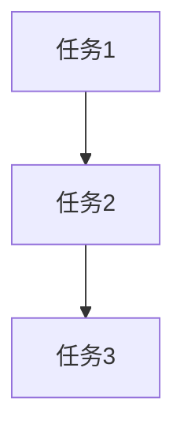

# 实施计划与架构设计

**生成时间**: {{TIMESTAMP}}
**任务名称**: {{TASK_NAME}}

---

## 1. 现有架构分析

| 层级 | 模式 | 现有实现 | 备注 |
|------|------|----------|------|
| 数据层 | | | |
| 业务层 | | | |
| 接口层 | | | |

---

## 2. 架构方案对比

| 方案 | 优点 | 缺点 | 适用场景 |
|------|------|------|----------|
| 方案 A | | | |
| 方案 B | | | |
| 方案 C | | | 推荐 |

---

## 3. 方案详情

### 方案 A: [方案名称]

**实现思路**:

**关键代码位置**:

**代码示例**:
```语言
// 关键代码片段
```

**优势**:
-
-

**劣势**:
-
-

---

### 方案 B: [方案名称]

**实现思路**:

**关键代码位置**:

**优势**:
-
-

**劣势**:
-
-

---

### 方案 C: [方案名称]（推荐）

**实现思路**:

**关键代码位置**:

**选择理由**:
-
-

---

## 4. 实施计划

### 阶段 1: 数据层
1. [ ] 创建数据模型
2. [ ] 创建请求/响应模型

### 阶段 2: 业务层
3. [ ] 创建业务逻辑服务
4. [ ] 添加外部服务调用
5. [ ] 添加异常处理

### 阶段 3: 接口层
6. [ ] 创建 API Handler
7. [ ] 注册路由
8. [ ] 添加中间件

### 阶段 4: 验证
9. [ ] 编译构建通过
10. [ ] 静态检查通过
11. [ ] 代码格式化

### 阶段 5: 测试
12. [ ] 编写测试计划
13. [ ] 编写测试用例
14. [ ] 执行测试

---

## 5. 任务依赖关系



### 并行任务
以下任务可以并行开发：
-

---

**请选择一个架构方案：**
- 输入 `A` / `B` / `C` 选择方案
- 或描述你的想法
